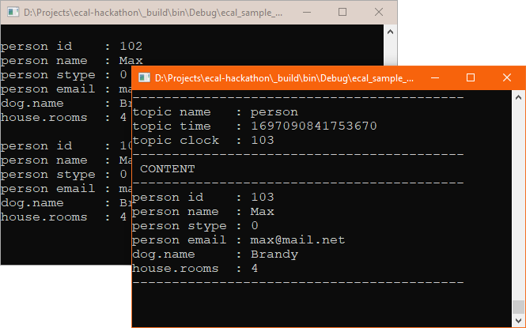

# Trace Debugging for Eclipse eCAL™ 🐛

This is a **contribution challenge**. The goal is to add **trace debugging** to [Eclipse eCAL™](http://ecal.io) using [Open Telemetry](https://opentelemetry.io/).

# 📚 About

Eclipse eCAL is a **publish subscribe** Middleware with the main focus on research and development of **autonomous driving** algorithms.

- A Publisher **publishes data** to a topic, identified by a name.
- A Subscriber **subscribes to a topic**, identified by a name. When it received data, it calls a **callback function**.

In a 1:1 connection, that looks like follows:

[](https://mermaid.live/edit#pako:eNq1kMsKwjAQRX8lzLr-QBYFH1tB6DabSTJtg0mqeQhS-u9GIxQE3Tmrmbl35sKZQU2agEOkayav6GBwCOiEZ6VOWVoTRwqbtu2yjCoYSYEzFwe2rRZUydwwEVv1Kqzzx_EerZWoztWm6euHX-m7P6ZDA46CQ6MLl_lpFJBGciSAl1ZTj9kmAcIvxYo5Td3dK-ApZGogX3R598YIvEcby5a0SVM4VtYv5MsDKi6Cyg)

As you can think, with **more nodes**, it is getting complicated! Especially, when a callback is still running while new data is being published, that data has to be **dropped**.

Let's look at another example:

[](https://mermaid.live/edit#pako:eNptkT-PwjAMxb9K5AkkGOiYAQmubKCrrmsWN3FLRP4caXLSCfHdL0CFeoVMjv3eT0_2BaRXBBx6OidykkqNXUArHMuvSo3R_ZHCcr3OdZ2aFWe279jmMUcZ9Q9GYsPw6bp9xp69dx37QGMalKcpewrfsln59VlVu3L-HlgMIdjMeqVbTWoQKnqfaNItxthijP0f8QWXjbAAS8GiVnlpl5tOQDySJQE8l4paTCYKEO6apZiir3-dBB5DogWkb5Vpw46Bt2j63CWlow-HxyHu97j-ARlshOw)

The `PubSub2` node may now ask:

> *Why wasn't I informed about `msg A`?* 🤔

Well, nobody knows, because the charts you are seeing above don't exist, yet. 😣

Debugging this inter-process time-related behavior is hard. You cannot use traditional debuggers like `gcc`, as that would **modify the behavior** That's why we want to add **trace debugging** to eCAL.

# 🎯 Goal

The goal is to know: **What is happening when? And why?**

- When was the data published?
- How long did it take to transmit the data?
- How long did the callback need to process the data?
- Who triggered the callback?

**OpenTelemetry** is a library that can be used to **generate traces** at runtime without actually debugging and/or stopping the process. These traces can be **visualized** using a tool like **Jaeger**:


# 💡 Need to know

- C++
- CMake

*We recommend using Windows or Linux. MacOS may work too, but eCAL is poorly tested on that OS.*

# 👨‍🏫 Hack-Coaches

- Kerstin Keller
- Florian Reimold
- Kristof Hannemann
- Rex Schilasky

# 🛠 Template Setup

1. Checkout eCAL

    ```cmd
    git clone https://github.com/eclipse-ecal/ecal.git
    cd ecal
    git submodule init
    git submodule update
    ```

2. CMake and build a minimalistic eCAL configuration

    ```cmd
    mkdir _build
    cd _build

    cmake .. -DBUILD_APPS=OFF -DHAS_QT5=OFF -DHAS_HDF5=OFF -DECAL_THIRDPARTY_BUILD_FINEFTP=OFF -DECAL_THIRDPARTY_BUILD_CURL=OFF -DECAL_THIRDPARTY_BUILD_HDF5=OFF -DECAL_THIRDPARTY_BUILD_QWT=OFF -DCMAKE_BUILD_TYPE=Debug

    cmake --build . --config Debug
    ```

3. Start Samples

    - Start `ecal_sample_person_snd` and `ecal_sample_person_rec` from the `_build/bin/` directory:

        

4. Add Open Telementry

    - Well, you are on your own on this one, but we are here to help! 😊

# 👀 All necessary links

**Eclipse eCAL**:
- 🏠 Homepage: http://ecal.io
- 👨‍💻 GH Repository: https://github.com/eclipse-ecal/ecal
- 💡 How to compile eCAL: https://eclipse-ecal.github.io/ecal/development/building_ecal_from_source.html

**Open Telemetry**
- = *Library for generating traces*
- 🏠 Homepage: https://opentelemetry.io/
- 👨‍💻 GH Repository: https://github.com/open-telemetry/opentelemetry-cpp
- 💡 Open Telemetry in C++: https://opentelemetry.io/docs/demo/services/currency/

**Jaeger**:
- = *Viewer for OpenTelemetry data*:
- 🏠 Homepage: https://www.jaegertracing.io/
